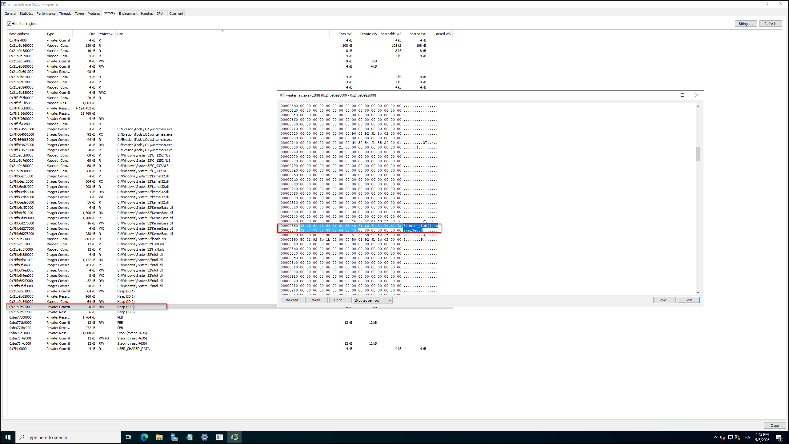
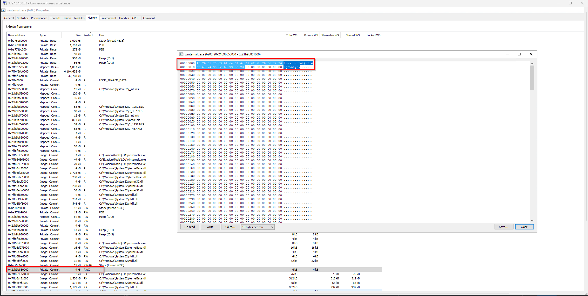
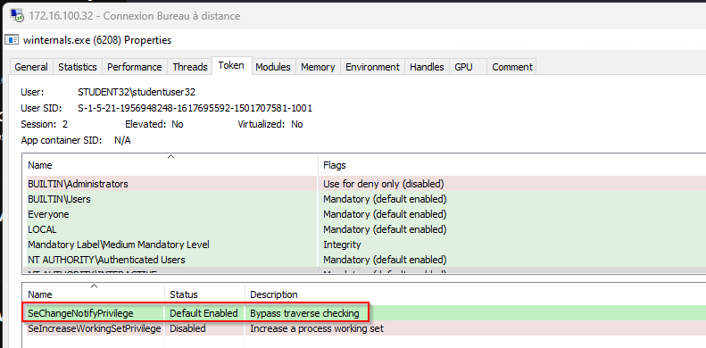

- Refer to to the folder C:\Evasion\Tools\LO1 to find the executable winternals.exe.
	- Use Process Hacker and inspect the Heap’s Memory to find the flag.

- Use Process Hacker and inspect RWX Memory region to find the flag.

- Use Process Hacker and inspect the winternals.exe process’s token to find the only enabled privilege.
