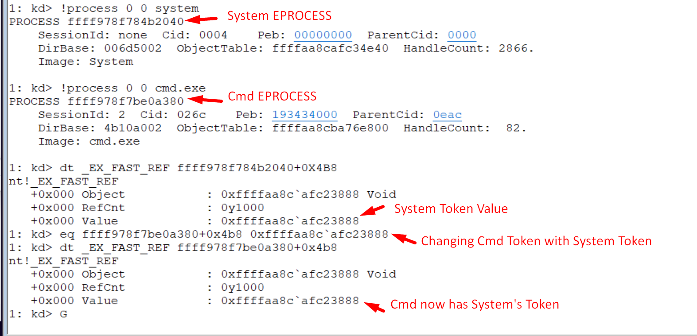
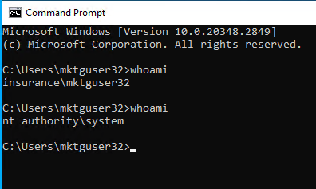

- Use Windbg Remote X-Mktg-X Kernel Debugging on StudentVM to change a cmd’s token to SYSTEM token.
-  First of all, we need to find the offset and read its `Token` field:
```bash
0: kd> dt !_eprocess token
nt!_EPROCESS
   **+0x4b8** Token : _EX_FAST_REF
```
- Then, we need to find the `_EPROCESS` of a `SYSTEM` and for `cmd.exe`process via `!process 0 0`
```bash
1: kd> !process 0 0 system
PROCESS ffff968ebc89c080
    SessionId: none  Cid: 0004    Peb: 00000000  ParentCid: 0000
    DirBase: 006d5000  ObjectTable: ffffab034c43ff00  HandleCount: 1775.
    Image: System
    
1: kd> !process 0 0 cmd.exe
PROCESS ffffcc03c37a30c0
    SessionId: 2  Cid: 1a88    Peb: 6cd2dca000  ParentCid: 0824
    DirBase: 5b99e000  ObjectTable: ffffde0586d59a80  HandleCount:  82.
    Image: cmd.exe

```
- Write that token value into the `Token` field of the target process.
```bash

1: kd> dt _EX_FAST_REF ffffcc03bdc9b040+0x4b8
nt!_EX_FAST_REF
   +0x000 Object           : 0xffffde05`80c18798 Void
   +0x000 RefCnt           : 0y1000
   +0x000 Value            : 0xffffde05`80c18798
   
1: kd> eq ffffcc03c37a30c0+0x4b8 0xffffde05`80c18798

1: kd> dt _EX_FAST_REF ffffcc03c37a30c0+0x4b8
nt!_EX_FAST_REF
   +0x000 Object           : 0xffffde05`80c18798 Void
   +0x000 RefCnt           : 0y1000
   +0x000 Value            : 0xffffde05`80c18798

```


- Use Windbg Remote X-Mktg-X Kernel Debugging on StudentVM to Hide the cmd process.
- Use Windbg Remote X-Mktg-X Kernel Debugging on StudentVM to change the notepad process protection level to PsProtectedSignerAntimalware-Light and remove the LSA protection from LSASS.
- Use Windbg Remote X-Mktg-X Kernel Debugging on StudentVM to hide a loaded driver.