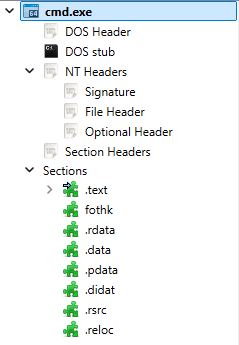

---
tags:
  - cetp
  - windows-internals
  - PE
  - user-mode
  - kernel-mode
status: todo
lo: LO-01, LO-02, LO-03
---
# Module I - Windows Internals - PE Format

## Key Concepts

### PE Format
A PE (Portable executable) is a file format for executables for Windows. A few example of PE file extensions are `.exe`, `.dll`, `.sys` and `.src`. 

The diagram shows a simplified structure of a PE file. Every header is defined as a data structure that hold information about the PE file. 

### PE Headers
#### Dos Header
- It contains the 64 bytes of the file.
- First 2 bytes called ``e_magic`` it's value are always ``4D 5A`` which represent "``MZ``" the **DOS Header signature.** We use to check the validity of the PE file.
- it's last 4 bytes called `e_lfanew`, tells where the **PE/NT Header** is located.
- Note that `e_lfanew` is always located at an offset of `0x3C`.
#### DOS stub
- Piece of code that runs “This program cannot be run in DOS mode” when the program is only compatible with DOS mode. This is not a PE header, but it's good to be aware of it.
#### NT/PE Header
- Starts with `50 45 00 00` which is `PE\0\0` in ASCII representing the PE signature.
- The File Header contains some PE's properties like : architecture type of the computer.

## References
