# Module I. Windows Internals. Process. Kernel Mode

## Key Concepts

- [ ] Understand the role of the kernel and its address space boundaries.
- [ ]  Identify the key fields of `_EPROCESS` and their offensive relevance.
- [ ]  Explain how `ActiveProcessLinks` works and how DKOM abuses it to hide processes.
- [ ]  Describe the token structure and how token stealing enables privilege escalation.
- [ ]  Understand how modifying the Protection field of `_EPROCESS` enables PPL bypass.

### General

**Kernel** : piece of code running in memory with full system privileges. Its main responsibilities are managing all running processes on the system, ensuring each process has a separated memory space, and enforcing privilege levels and security barriers between processes.

**System Address Space** : 128 TB, from `0xFFFF8000 00000000` to `0xFFFFFFFF FFFFFFFF`.

The kernel tracks the state of every process using the `_EPROCESS` structure. `_EPROCESS` is an **opaque kernel structure**, meaning its layout changes across Windows versions. Rootkits that rely on hardcoded offsets break between builds. Modern tools use pattern scanning to find offsets dynamically.
### _EPROCESS Overview

`_EPROCESS` is the kernel's internal representation of a process. Every running process has one associated structure in kernel memory.

**Get the EPROCESS address of a process :**

```windbg
!process 0 0 explorer.exe
```

**Inspect all fields of an EPROCESS structure :**

```windbg
dt nt!_EPROCESS <EPROCESS_addr>
```

**Key fields and their offensive relevance :**

| Field                          | Offensive Use                                             |
| ------------------------------ | --------------------------------------------------------- |
| `UniqueProcessId`              | PID, process identification                               |
| `ImageFileName`                | Process name comparison, used by EDR callbacks            |
| `Token`                        | Token stealing for privilege escalation                   |
| `Protection`                   | Modify to bypass PPL (Protected Process Light)            |
| `ActiveProcessLinks`           | DKOM, unlink to hide a process                            |
| `InheritedFromUniqueProcessId` | PPID spoofing, identify and fake the parent               |
| `Peb`                          | Access the Process Environment Block                      |
| `ObjectTable`                  | Stores handles to all kernel objects owned by the process |
| `SectionBaseAddress`           | Base address of the mapped executable                     |
| `ThreadListHead`               | Iterate all threads belonging to the process              |
### ActiveProcessLinks & Process Hiding

`ActiveProcessLinks` is a **doubly-linked list** that chains all running processes together inside the kernel.

**List all processes via ActiveProcessLinks :**

```windbg
!process 0 0
dt nt!_LIST_ENTRY <EPROCESS_addr>+<offset_ActiveProcessLinks>
```

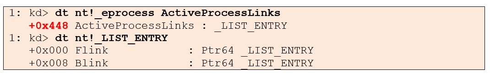

**Structure :**

Each `_EPROCESS` contains an `ActiveProcessLinks` field with two pointers. **Flink** points to the `ActiveProcessLinks` of the next process. **Blink** points to the `ActiveProcessLinks` of the previous process.

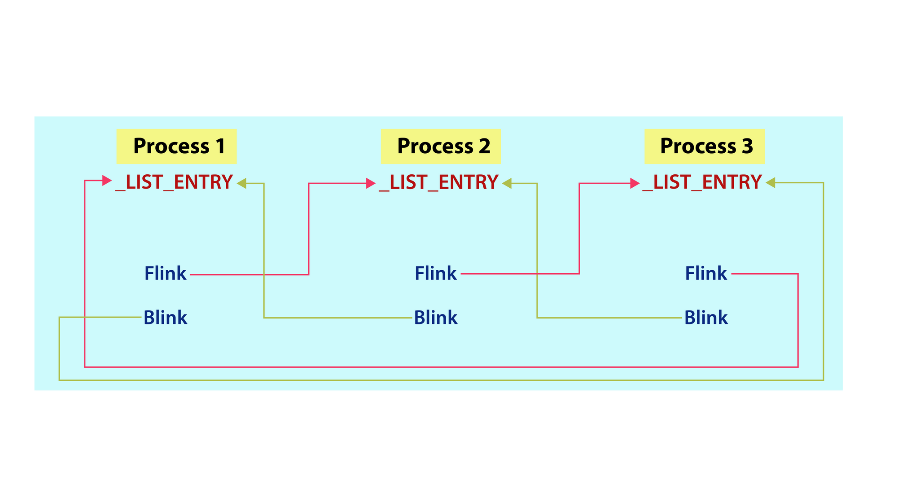

**DKOM. Hiding a process :**

To hide a process (e.g. `cmd.exe`) from the linked list, we unlink its `ActiveProcessLinks` by :
1. Setting the **previous process** `Flink` to point to the **next process** `ActiveProcessLinks`.
2. Setting the **next process** `Blink` to point to the **previous process** `ActiveProcessLinks`.

The process is now invisible to `tasklist`, Task Manager, and Process Hacker, but it is still running.

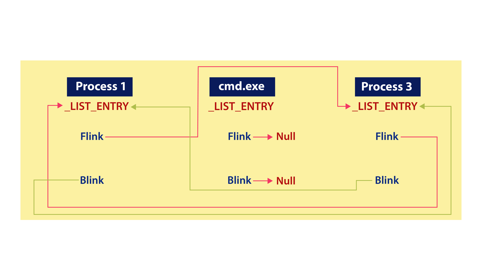

> **Detection note** : DKOM only removes the process from the linked list. The process is still visible via its open handles, network connections, and ETW Process Notify Callbacks. Cross-referencing these sources is how Volatility3 `windows.psxview` detects hidden processes.
### Token

The `Token` field in `_EPROCESS` is of type `_EX_FAST_REF` and holds the security context of the process, including user identity, group memberships, and privileges.

**Inspect a process token :**
```windbg
dt nt!_EX_FAST_REF <token_addr>
!token <token_addr>
```

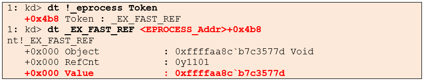
### Token & Privilege Escalation

Token stealing consists of copying the `SYSTEM` token from a privileged process such as `winlogon.exe` into a lower-privileged process to inherit its security context.

**Steps :**
1. Find the `_EPROCESS` of a `SYSTEM` process via `!process 0 0`.
2. Read its `Token` field.
3. Write that token value into the `Token` field of the target process.

The target process now runs as `SYSTEM` without spawning a new privileged process.

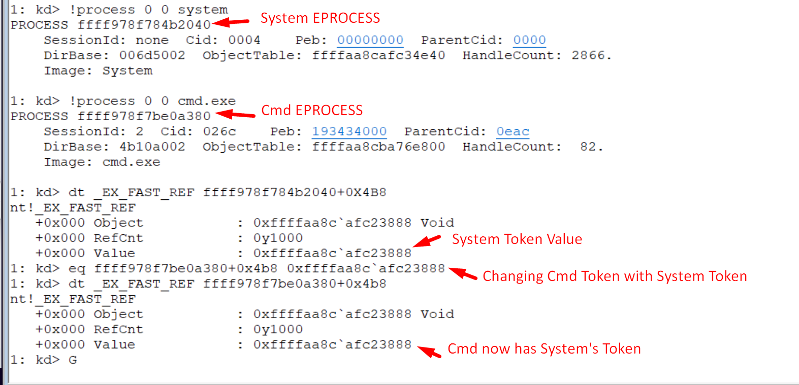
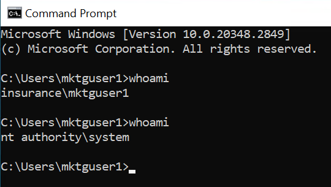
### Token & EDR Downgrade

By modifying the `Protection` field of an EDR process's `_EPROCESS`, it is possible to downgrade its protection level, turning a `PS_PROTECTED_ANTIMALWARE_LIGHT` process into an unprotected one and allowing arbitrary handle access.

This is the technique used by tools like `PPLKiller` to open a handle to `lsass.exe` despite its PPL protection.

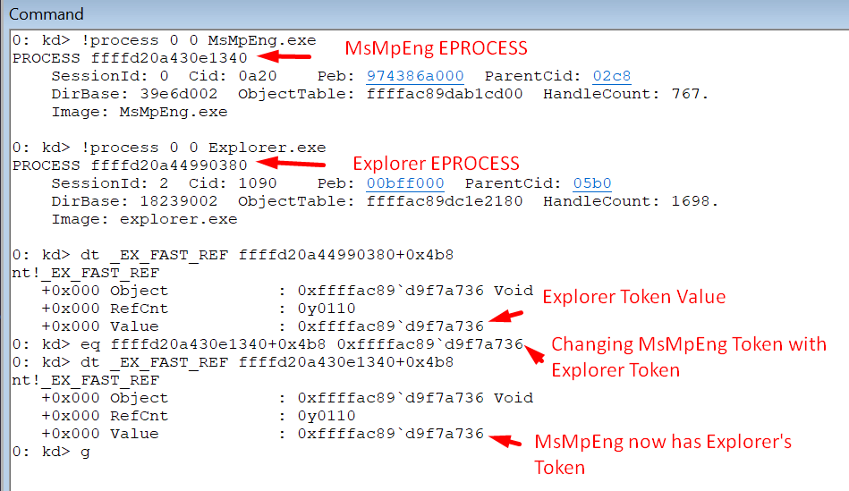
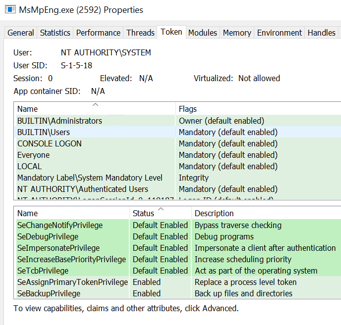
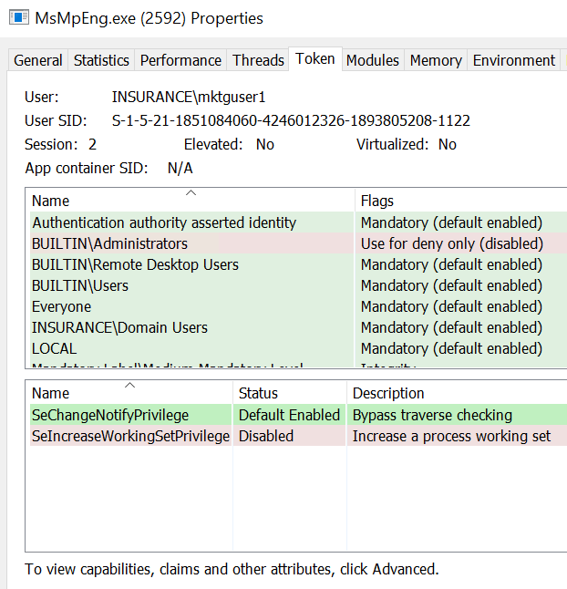

> **Kernel Patch Guard** : KPG periodically verifies the integrity of certain kernel structures. Modifying `_EPROCESS` on a KPG-enabled system can trigger a BSOD. That said, `ActiveProcessLinks` and the `Token` field are not always monitored, which is why DKOM and token stealing still work on some configurations.

### Protection and LSASS Dump
The Process Protection Level resides in the Kernel as 1 byte value, it's part of the EPROCESS stuctrure under the the protection field. It's a combinaison of 8 bits (Type, Audit, Signer).
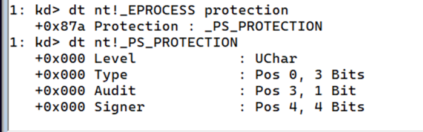

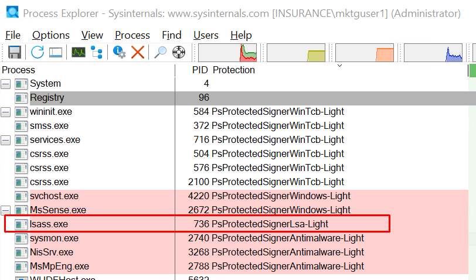

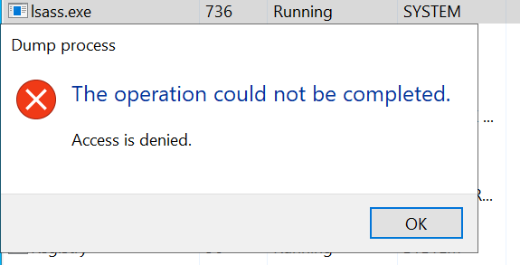
## Offensive Relevance

| Technique             | EPROCESS Field                 | Impact                                              |
| --------------------- | ------------------------------ | --------------------------------------------------- |
| Process hiding (DKOM) | `ActiveProcessLinks`           | Invisible to tasklist, Task Manager, Process Hacker |
| Token stealing        | `Token`                        | Escalation to SYSTEM without spawning a new process |
| PPL bypass            | `Protection`                   | Open handle to LSASS or EDR process                 |
| PPID spoofing         | `InheritedFromUniqueProcessId` | Fake a legitimate parent process                    |
## Detection & Mitigations

| Technique      | Detection                                              | Tool / Event                                            |
| -------------- | ------------------------------------------------------ | ------------------------------------------------------- |
| DKOM           | Cross-reference ActiveProcessLinks with open handles   | Volatility3 `windows.psxview`                           |
| Token stealing | Unusual token on a process                             | Event ID 4688, abnormal parent token                    |
| Token stealing | API monitoring                                         | EDR : `PsReferencePrimaryToken`, `SeAssignPrimaryToken` |
| PPL bypass     | Handle open on a protected process                     | EDR : `ObRegisterCallbacks`                             |
| ETW            | Process Notify Callbacks remain active even after DKOM | ETW : `PsSetCreateProcessNotifyRoutine`                 |


## References

- [Microsoft, _EPROCESS and process internals](https://learn.microsoft.com/en-us/windows-hardware/drivers/kernel/eprocess)
- [Microsoft, Protected Processes](https://learn.microsoft.com/en-us/windows/win32/services/protecting-anti-malware-services-)
- [Alex Ionescu, PPL internals](https://www.alex-ionescu.com/?p=97)
- [Volatility3, windows.psxview](https://volatility3.readthedocs.io/en/latest/volatility3.plugins.windows.psxview.html)
- [MITRE T1134, Token Impersonation](https://attack.mitre.org/techniques/T1134/)
- [MITRE T1055, Process Injection](https://attack.mitre.org/techniques/T1055/)
- [ired.team, Token stealing](https://www.ired.team/offensive-security/privilege-escalation/t1134-access-token-manipulation)
