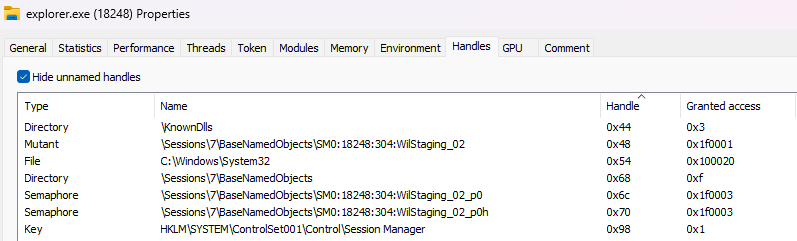
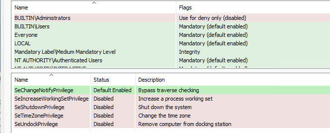
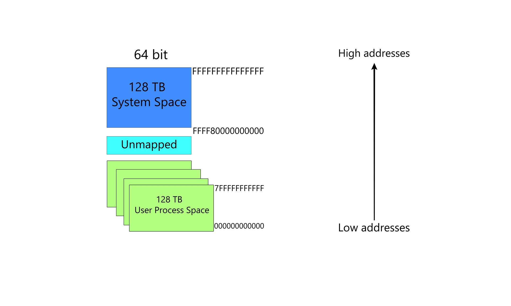

---
tags:
  - cetp
  - windows-internals
  - user-mode
status: in-progress
lo: LO-01, LO-02, LO-03
---
# Module I. Windows Internals. Process. User Mode

## Key Concepts

- [ ] Explain what a process is and what it manages.
- [ ] Identify the four integrity levels and their write permissions.
- [ ] Describe the three process protection levels and their purpose.
- [ ] Explain how mitigation policies reduce the attack surface and how they can be bypassed.
- [ ] Describe thread types, states, and stack switching during a syscall.
- [ ] Understand the role of the handle table and the access token.
- [ ] Identify the memory layout of a process in x64 user space and page protection types.

### Process Properties

A **process** is a container that isolates applications from each other. It manages four main resources : **Threads**, **Handles**, **Tokens** and **Memory**. Each process has its own address space, its own threads, its own handle table, its own token, and a unique **PID**.

A process does not execute code by itself. Only **Threads** run code. A process is identified by its **Process ID (PID)**, not by its executable name. When a process is destroyed, its PID can be reused by another process.

The three core components managed by a process are defined as follows.

A **Thread** is the smallest sequence of programmed instructions that can be managed by a scheduler. It exists within a process and shares its memory space with other threads of the same process.

A **Handle** is an abstract reference to a kernel object such as a file, process, thread, or registry key. It allows user-mode code to interact with kernel resources without direct memory access.

A **Token** is a kernel object that describes the security context of a process or thread, including user identity, group memberships, and privileges.

---
### Integrity Levels

Every process runs at an integrity level that defines what it can access and write to.

**Low integrity** is the least trusted level. It can only interact with other low-integrity processes and write to specific locations such as `%USERPROFILE%\AppData\LocalLow` and limited areas of `HKEY_CURRENT_USER`.

**Medium integrity** is the default level for most user processes such as Microsoft Word. It can interact with Medium or Low integrity processes and write to user-owned folders like Documents, Downloads, Desktop, and `AppData\Roaming`.

**High integrity** applies to processes running with administrative privileges. It can interact with High, Medium, and Low integrity processes and write to system directories such as `C:\Windows` and `C:\Program Files`, with full access to registry keys.

**System integrity** is the highest level. It can interact with all integrity levels and has full access to the file system and all registry keys.

> **Offensive relevance** : escalating from Medium to High integrity is the goal of most UAC bypass techniques. A process running at High integrity can write to system directories and interact with all other processes.

---
### Process Protection Levels

Protection levels are defined by two components. The **Signer** identifies who signed the process (Windows, LSA, Antimalware). The **Protection type** defines the strength of the protection, either Protected or Protected-Light.

**PS_PROTECTED_SYSTEM (0x72)**
Signer : WinSystem (7). Protection : Protected (2). Purpose : highest protection for hypervisor-related processes such as the kernel itself.

**PS_PROTECTED_LSA_LIGHT (0x41)**
Signer : LSA (4). Protection : Protected-Light (1). Purpose : shields the Local Security Authority process (LSASS) to prevent credential dumping attacks such as Mimikatz.

**PS_PROTECTED_ANTIMALWARE_LIGHT (0x31)**
Signer : Antimalware (3). Protection : Protected-Light (1). Purpose : protects antivirus and antimalware software from tampering.

> **Offensive relevance** : modifying the `Protection` field of `_EPROCESS` from a non-zero value to `0x00` removes all protection from a process. This is the foundation of PPL bypass techniques used to open a handle to LSASS despite its protection level.

---
### Mitigation Policies

Mitigation policies are security mechanisms implemented in Windows to reduce the attack surface and protect against exploitation techniques.

**Data Execution Prevention (DEP)** prevents code execution from non-executable memory regions such as the stack and heap, blocking classic buffer overflow exploits. Bypassed via ROP (Return-Oriented Programming) chains or RWX memory allocation.

**Address Space Layout Randomization (ASLR)** randomizes the memory addresses of executables and DLLs to mitigate Return-Oriented Programming and code reuse attacks. Bypassed by finding a module compiled without ASLR and using it as the base for a ROP chain.

**Control Flow Guard (CFG)** validates indirect function calls against a bitmap of valid target functions to prevent memory corruption exploits. Bypassed by calling through function pointers not verified by CFG.

**Signature Restricted** allows only Microsoft-signed code to execute within the process.

**Image Restricted** blocks loading executables or DLLs from network shares such as SMB or WebDAV.

---
### Threads

A thread executes code and enables concurrent execution of tasks within a process. There are three types of threads.

The **Main Thread** executes the main function of the process. **Threads created by code** via APIs such as `CreateThread` execute specific functions or tasks defined by the programmer, running concurrently with the main thread. **Worker Threads** perform background tasks such as cleanup and resource management.

**Thread states** : a thread is in one of three states at any given moment. **Waiting** means the thread is paused, waiting for an event or condition. **Ready** means the thread is prepared to execute but waiting for processor availability. **Running** means the thread is actively executing code on a processor.

**Access modes** : a thread can operate in two modes. In **User mode**, the thread runs with limited privileges and uses the user mode stack. In **Kernel mode**, the thread runs with elevated privileges and can interact directly with hardware. When a thread performs a syscall, it switches to kernel mode and begins using the kernel mode stack.

**Thread stacks** : the **User mode stack** resides in the process user space, stores local variables, function parameters, and return addresses, and grows dynamically. The **Kernel mode stack** resides in kernel space, is smaller and fixed-size (12 KB on 32-bit systems, 24 KB on 64-bit systems).

The **Thread call stack** is the list of function calls that show the path the program took to reach its current point of execution.

> **Offensive relevance** : thread hijacking consists of suspending an existing thread via `SuspendThread`, modifying its instruction pointer via `SetThreadContext` to point to a shellcode, then resuming it via `ResumeThread`. This avoids creating a new remote thread, which is a well-known EDR detection signal.

---
### Table of Handles

The kernel exposes different types of objects such as directories, files, and processes to user-mode code through Handles. Every process maintains a private handle table to kernel objects. Each handle is defined by a unique value, a type, a name, and an access mask.

> **Offensive relevance** : the handle table is used to access kernel objects from user mode. Opening a handle to a protected process such as LSASS with `PROCESS_VM_READ` access is what tools like Mimikatz do to dump credentials. EDRs register callbacks via `ObRegisterCallbacks` to intercept and block these handle requests.

---
### Token

The access token stores the default security context of a process. It contains the user account and groups the process belongs to, defining what resources it can access, as well as the privileges granted to the process, indicating what actions it can perform.

> **Offensive relevance** : token impersonation via `ImpersonateLoggedOnUser` or token stealing via `DuplicateTokenEx` allows a process to inherit the security context of another user, including a SYSTEM context, without spawning a new privileged process.

---
### Virtual Memory

Each process in x64 user space has 128 TB of virtual address space, from `0x0000000000000000` to `0x0007FFFFFFFFFFFF`. The virtual address space is organized in the following order from lowest to highest address : USER_SHARED_DATA, PEB (Process Environment Block), Stacks, Heap, NLS and MUI Files, Allocated Pages, Executable File Image, Modules.

> **Offensive relevance** : the PEB (Process Environment Block) is targeted by shellcodes via PEB walking. It contains the list of loaded modules, which allows resolving WinAPI addresses without relying on the import table. This technique is used to avoid static detection of API calls.

**Page states** : a memory page exists in one of three states. 
**Free** pages are not allocated. 
**Committed** pages are actively allocated and backed by physical memory or the page file. **Reserved** pages have a reserved address space for future use but are not yet allocated.

**Page types** : memory pages are classified into three types. 
**Mapped** pages are associated with files on disk. 
**Private** pages are exclusive to a process and not shared. 
**Image** pages come from executable files such as EXE and DLL files.

**Page protections** :

| Protection | Description |
|-----------|-------------|
| R | Read only |
| RW | Read and Write |
| X | Execute only |
| RX | Read and Execute |
| RWX | Read, Write, and Execute |
| No Access | Any access attempt triggers `STATUS_ACCESS_VIOLATION` |
| Guard | Modifier flag combined with another protection, e.g. `PAGE_READWRITE \| PAGE_GUARD` |

> **Offensive relevance** : RWX pages are a strong EDR detection signal because they allow writing and executing code in the same region, which is the signature of a classic shellcode loader. The recommended approach is to allocate memory as RW, write the shellcode, then switch to RX via `VirtualProtect` before executing. This significantly reduces the detection surface.

---
## Offensive Relevance Summary

| Concept | Technique | Goal |
|---------|-----------|------|
| Integrity levels | UAC bypass | Escalate from Medium to High integrity |
| Protection levels | PPL bypass via `_EPROCESS` modification | Open handle to LSASS or EDR process |
| Thread hijacking | `SuspendThread` + `SetThreadContext` + `ResumeThread` | Inject code without `CreateRemoteThread` |
| Handle table | Open handle with `PROCESS_VM_READ` | Read memory of a target process |
| Token | Token stealing via `DuplicateTokenEx` | Inherit SYSTEM security context |
| RWX pages | Allocate RW then switch to RX via `VirtualProtect` | Execute shellcode with lower EDR visibility |
| PEB walking | Parse loaded modules list | Resolve WinAPI addresses without import table |

---
## Detection and Mitigations

| Technique | Detection | Tool or Event |
|-----------|-----------|---------------|
| UAC bypass | Registry modifications under `HKCU\Software\Classes` | Sysmon Event ID 13 |
| PPL bypass | Handle open on a protected process | EDR via `ObRegisterCallbacks` |
| Thread hijacking | Thread context modification on a remote thread | EDR, Sysmon Event ID 8 |
| Handle to LSASS | `PROCESS_VM_READ` handle request on LSASS | Event ID 4656, EDR via `ObRegisterCallbacks` |
| Token stealing | Unusual token on a spawned process | Event ID 4688, abnormal parent token |
| RWX allocation | Memory region with RWX protection | EDR memory scanning, ETW |

---

## References

- [Microsoft, Processes and Threads](https://learn.microsoft.com/en-us/windows/win32/procthread/processes-and-threads)
- [Microsoft, Process Threads API](https://learn.microsoft.com/en-us/windows/win32/api/_processthreadsapi/)
- [Microsoft, VirtualAlloc](https://learn.microsoft.com/en-us/windows/win32/api/memoryapi/nf-memoryapi-virtualalloc)
- [Microsoft, VirtualProtect](https://learn.microsoft.com/en-us/windows/win32/api/memoryapi/nf-memoryapi-virtualprotect)
- [Microsoft, Threat mitigations in Windows 10](https://learn.microsoft.com/en-us/previous-versions/windows/it-pro/windows-10/security/threat-protection/overview-of-threat-mitigations-in-windows-10)
- [Microsoft, Mandatory Integrity Control](https://learn.microsoft.com/en-us/windows/win32/secauthz/mandatory-integrity-control)
- [Microsoft, Access Tokens](https://learn.microsoft.com/en-us/windows/win32/secauthz/access-tokens)
- [ired.team, Token manipulation](https://www.ired.team/offensive-security/privilege-escalation/t1134-access-token-manipulation)
- [ired.team, Thread hijacking](https://www.ired.team/offensive-security/code-injection-process-injection/injecting-to-remote-process-via-thread-hijacking)
- [MITRE T1055, Process Injection](https://attack.mitre.org/techniques/T1055/)
- [MITRE T1134, Token Impersonation](https://attack.mitre.org/techniques/T1134/)
- [Virtual memory internals](https://medium.com/@derakhshanfar.hossein/all-you-need-to-know-about-virtual-memory-page-tables-page-faults-for-backend-engineers-0fdb4b6d1565)
