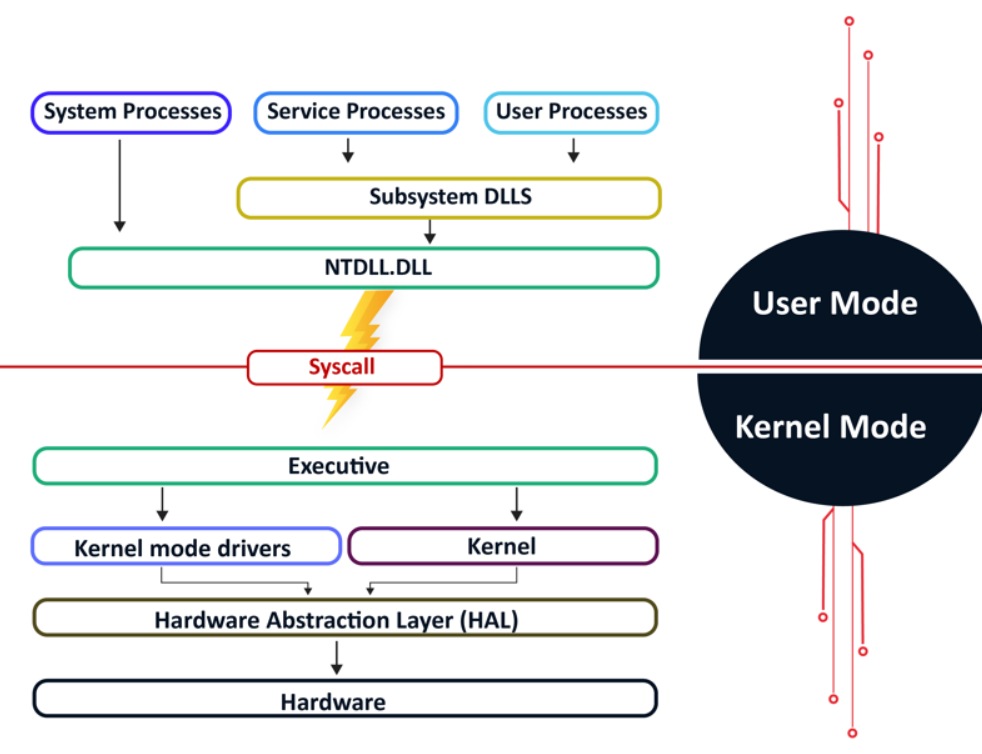
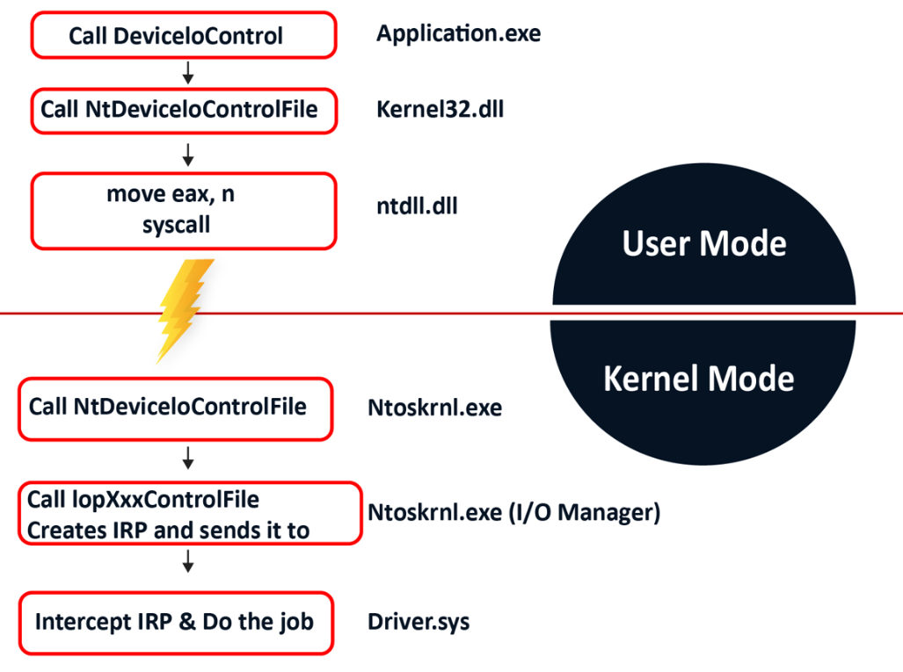

---
tags:
  - cetp
  - windows-internals
  - PE
  - user-mode
  - kernel-mode
status: todo
lo: LO-01, LO-02, LO-03
---
---
# Module I. Windows Internals. Windows Architecture

## Learning Objectives

- [ ] Explain the difference between user mode and kernel mode.
- [ ] Describe the function call flow from a user process to the kernel.
- [ ] Identify the role of each layer in the Windows architecture.
- [ ] Understand why `ntdll.dll` is the transition point between the two modes.
- [ ] Explain the offensive relevance of syscalls and the role of `ntoskrnl.exe`.

---
## Key Concepts

### Windows Architecture

A processor running Windows can operate in two modes. **User mode** is where applications run with limited privileges. **Kernel mode** is where the operating system runs with full access to hardware and system resources.

When an application needs to perform a privileged task such as creating a file, it cannot do so directly. Only the kernel can complete such operations. Applications must therefore follow a specific function call flow to request services from the kernel.

---
### The Function Call Flow

The call flow from a user process to the kernel goes through four layers.

**User process.** A program or application executed by the user, such as Notepad or Word, initiates the request by calling a Windows API function.

**Subsystem DLLs.** These are DLLs that export API functions called by user processes. A common example is `kernel32.dll`, which exports functions like `CreateFile`. Other well-known subsystem DLLs include `ntdll.dll`, `advapi32.dll`, and `user32.dll`.

**ntdll.dll.** This is a system-wide DLL and the lowest layer available in user mode. It is a special library responsible for transitioning from user mode to kernel mode. It does this by issuing a **syscall instruction**, which switches the processor to kernel mode and transfers execution to the kernel.

**Executive kernel.** This is the Windows kernel itself. It receives the request from `ntdll.dll`, calls the appropriate drivers and modules available in kernel mode, and completes the task. The Windows kernel is partially stored in `ntoskrnl.exe`, located at `C:\Windows\System32\ntoskrnl.exe`.

> **Offensive relevance.** EDRs hook functions inside `ntdll.dll` to intercept API calls before they reach the kernel. By calling syscalls directly, bypassing `ntdll.dll` entirely, an attacker can avoid these hooks. This technique is known as **direct syscalls** and is a core evasion method covered in the CETP.

---
## Offensive Relevance Summary

|Concept|Technique|Goal|
|---|---|---|
|`ntdll.dll` hooks|Direct syscalls|Bypass EDR user-mode hooks|
|`ntdll.dll` hooks|Indirect syscalls|Bypass EDR with cleaner call stack|
|`ntoskrnl.exe`|Kernel exploits|Gain kernel-mode code execution|
|Subsystem DLLs|IAT hooking|Intercept or redirect API calls|

---
## Detection and Mitigations

|Technique|Detection|Tool or Event|
|---|---|---|
|Direct syscalls|Syscall instruction outside `ntdll.dll` address range|ETW, EDR behavioral analysis|
|Indirect syscalls|Unusual call stack patterns|EDR call stack analysis|
|`ntdll.dll` unhooking|`ntdll.dll` re-read from disk at runtime|EDR memory integrity checks|

---
## References

- [Microsoft, User mode and kernel mode](https://learn.microsoft.com/en-us/windows-hardware/drivers/gettingstarted/user-mode-and-kernel-mode)
- [ired.team, Direct syscalls](https://www.ired.team/offensive-security/defense-evasion/using-syscalls-directly-from-visual-studio-to-bypass-avs-edrs)
- [MITRE T1055, Process Injection](https://attack.mitre.org/techniques/T1055/)
- [MITRE T1562, Impair Defenses](https://attack.mitre.org/techniques/T1562/)